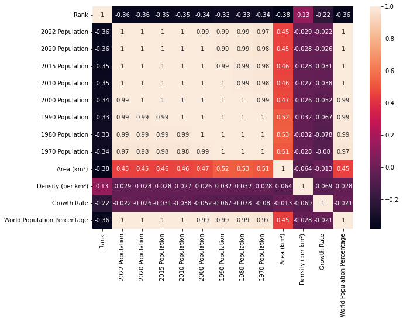

# Exploratory Data Analysis

```
import pandas as pd
import seaborn as sns
import matplotlib.pyplot as plt
```
Using the World Population DS.
```
df = pd.read_csv(r"path to ds")
pd.set_option('display.float_format', lambda x: '%.2f' % x) # changes decimal format
df.info() # gives us important info!! how many values/columns/types...
df.describe() # gives us count, mean, std, min...
```
How many values are we missing?
```
df.isnull().sum
```
When we do this, we get all the columns and how many values we are missing in each.
```
df.nunique()
```
Shows all the unique values.
```
df.sort_values(by="World Population Percentage", ascending=False).head(10)
```
It'll give us the largest top 10 population. 
```
df.corr()
```
Correlations - will compare every column to every other column and see how corelated they are. 
```
sns.heatmap(df.corr(), annot = True)
plt.rcParams['figure.figsize'] = (20,7)
plt.show()
```

This heatmap visually represents the correlation amongst columns. The population is highly related to each other but the rank is barely related at all.

```
df.groupby('Continent').mean().sort_values(by="2022 Population",ascending=False)
df[df['Continent'].str.contains('Oceania')]
```
Will group the population by continent - easier to look at. 
Will show us all the countries in Oceania.

```
df2 = df.groupby('Continent')[['1970 Population',
       '1980 Population', '1990 Population', '2000 Population',
       '2010 Population', '2015 Population', '2020 Population',
       '2022 Population']].mean().sort_values(by="2022 Population",ascending=False)
# to switch rows and columns
df3 = df2.transpose()
```
