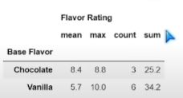
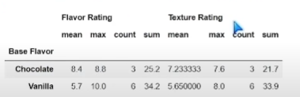
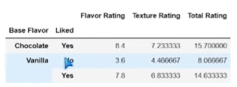
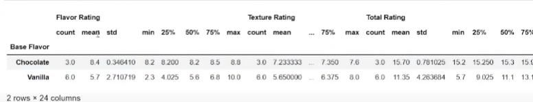

# Group By + Aggregating

```
import pandas as pd
df = pd.read_csv(r'flavors file')
```

### Group By
You want to look at different rows that have duplicate values or similar values on different rows - base flavor

```
group_by_frame = df.groupby('Base Flavour')
```
This itself is an object.
```
group_by_frame.mean()
```



The base flavor has become our index column, and then its taking the mean or the average of all the columns that have integers. It didn't take the string columns because those cannot be aggregated for this.

We can combine all of this into one line instead.

```
df.groupby('Base Flavour').mean()
```

There are also other aggregate functions we can try:
```
df.groupby('Base Flavour').mean() -> only int
df.groupby('Base Flavour').count() -> only int
df.groupby('Base Flavour').min() -> has strings
df.groupby('Base Flavour').max() -> has strings
df.groupby('Base Flavour').sum() -> only int
```
Min and max will have a string column where it looks at the minimum value in Flavor (alphabetically).

Now lets look at our aggregate function. What we need to pass is a dictionary. 
```
df.groupby('Base Flavor').agg({'Flavor Rating':['mean', 'max', 'count', 'sum]})
```


Now we have one column with multiple columns of our aggregations.

```
df.groupby('Base Flavor').agg({'Flavor Rating':['mean', 'max', 'count', 'sum'], 'Texture Rating': ['mean', 'max', 'count', 'sum']})
```



### Grouping on Multiple Columns

```
df.groupby(['Base Flavor', 'Liked']).mean
```



Chocolate only had yes, which is why there is only one column for it. 

We can also do :
```
df.groupby('Base Flavor').describe()
```
Which results in something like this:

