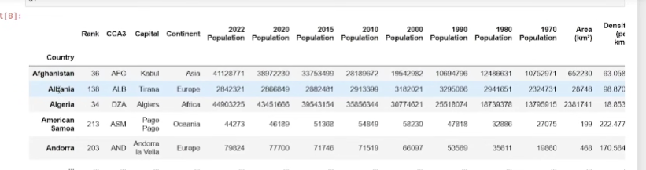

# Indexing

The index is an object that stores the access labels for all Panda objects. The index in a data frame is extremely useful because its customizable and you can also search and filter based off of that index. 

```
import pandas as pd
df = pd.read_csv(r'world population.csv path")
```
Note that we have columns like rank, country, continent, population as well as the default index (0 to 233).

In this case, each number for the index should be unique but this doesn't always have to be the case. 

Let's change this to:
```
df = pd.read_csv(r'world population.csv path", index col = "Country")
```


Country becomes our header and you can also notice this become bolded and a different format than the columns on the right.

### LOC and ILOC
LOC -> location
ILOC -> Integer location

```
df.loc['Albania']
```
This returns all the data for Albania. 
```
df.iloc[1]
```
Will return the same thing because its the second row in our df.

### Resetting and Setting Index
```
def.reset_index(inplace = True)
df.set_index(['Continent'. 'Country'], inplace = True)
```
Now we have two columns working as our index. One thing we can specifically notice is the repeats for Continent. 


Asia, Europe etc.

We can sort these values to make it look a bit better.
```
df.sort_index()
pd.set_option('display.max.columns', 235)
```
Now when we run this, all the countries are grouped together by continent. 

We can also do:
```
df.sort_index(ascending = [True, False])
```

If we were to try:
```
df.loc['Angola']
```
It would not work. That's because its searching through the first column - in this case, the continent column. 
```
df.loc['Africa', 'Angola']
```
Will return what we need.

Previously, when we tried this with one index column:
```
df.iloc[1]
```
We got Albania's information.
If we were to try now (with two index columns), we still get Albania. 

The thing with loc is that you are able to specify whereas with iloc doesn't go off the multi-indexing, it's going to go based off the intial index or the integer based index. 

