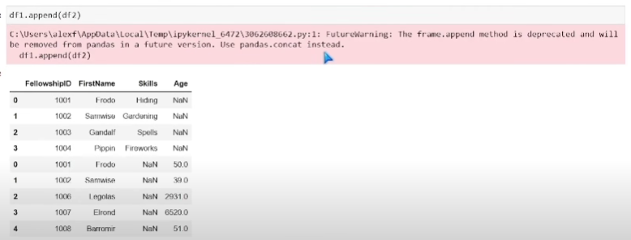

## Merge, Join, and Concatenate


The shaded area is the area that is returned.

```
import pandas as pd
df1 = pd.read_csv(r'path1.csv') #LOTR
df2 = pd.read_csv(r'path2.csv') #LOTR 2
```

### Merge
Just like the joins mentioned earlier. 
```
df1.merge(df2)

```
The first mentioned df is the one that is the 'left' circle of the venn diagram.


The merged df and outputs the ones the shared id columns - the ones that are common in between both circles.
```
df1.merge(df2, how = 'inner', on = 'FellowshipID')
```
In this case, it will seperate the first names because they aren't being merged. 


If we were to do:
```
df1.merge(df2, how = 'inner', on = ['FellowshipID', 'FirstName'])
```
We would get the same output as the first image. 

```
df1.merge(df2, how = 'outer')
```
This output will show us all the values, regardless of if the ids match.
It will fill the empty values with NaN.


When how = left, everything from the left table is taken. If there is any overlap from the right table, it will put that as well.

When how = right, everything from the right table is taken. If there is any overlap from the left table, it will put that as well. 

When how = cross, it takes each value from the left df and compares it to each value in the right df. 

## Joins

```
df.join(df2, on = 'FellowshipId', how = 'outer', lsuffix = '_l', rsuffix = '_r')
```
The join usually works better with indexes, so let's try that.
```
df4 = df1.set_index('FellowshipID').join(df2.set_index('FellowshipID'), lsuffix = '_l', rsuffix = '_r', how = 'outer')
```

## Concatenate

"Putting one df on top of another rather than putting one df next to another"

```
pd.concat([df1, df2])
```
It takes the first df and put it on top of the second df. Like adding both of them on top of each other. 


```
pd.concat([df1, df2], join = 'outer', axis = 1)
```


## Append
Not recommended.
Used to append rows from one df to the end of the other df.

```
df1.append(df2)
```

Refer to warning.