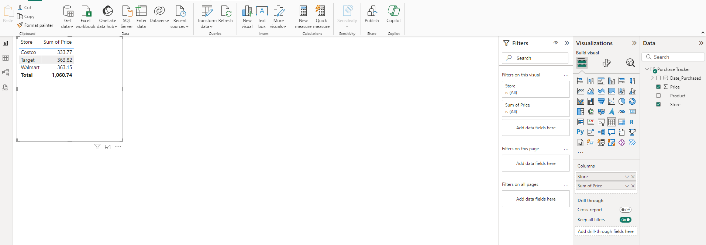
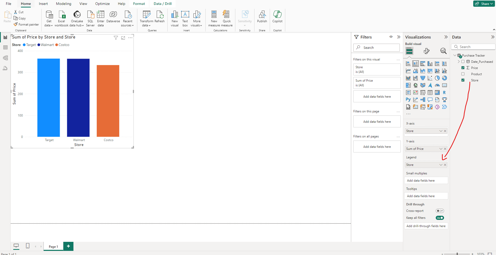
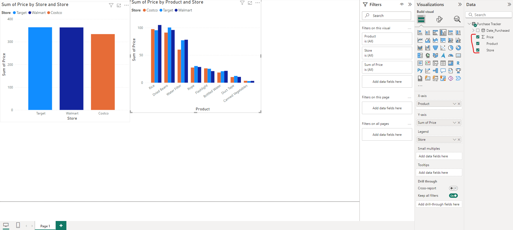
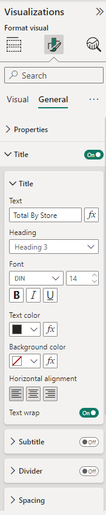
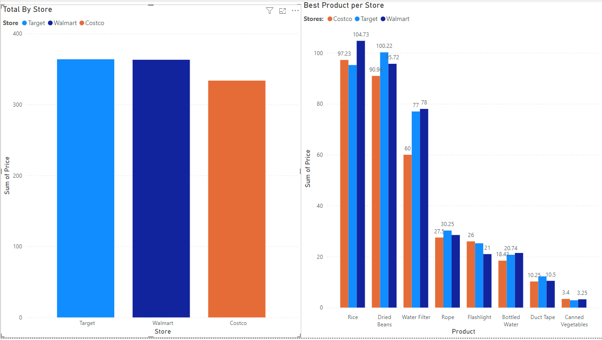

### PowerBi

- Using PowerBi Desktop, standard process to open a workbook (same as tableau/excel) except you just need to tick which sheets you are using.
- Manipulating data - opens up Power Query Editor.

### Power Query Editor
- Any changes that you make to your data will be accessible on the RHS under applied steps.
- Filtering out irrelevant data (like milk for this scenario)
- Close and apply to apply the changes made

### Back to desktop
- report view, table view, model view.
- table view shows all of the data that we are working with.
- model view is helpful for joins and more expansive datasets. 

If we want to visualize where we spend the least at...

Now we know where we are spending the least altogether, but is that the case for each product?

This panel will allow you to alter all the fine visual details of ur diagram - decimal points, titles, values...

This is the final visual for this part of the tutorial. 
