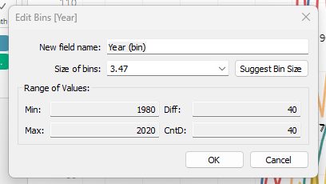
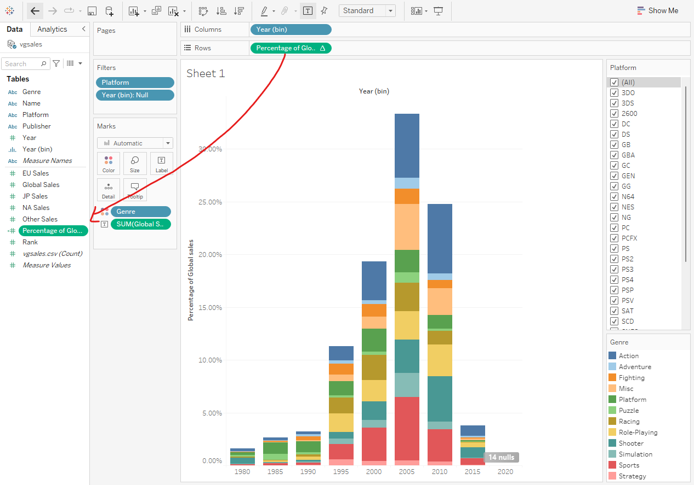
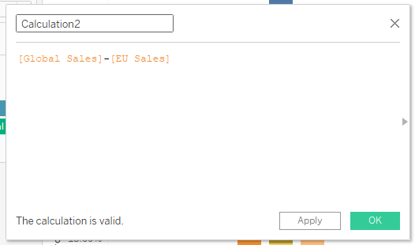

### Bins
- groupings or ranges of numerical values
- can't make for name, genre, platform or anything of the sort
- Using years for the data.

> Year > dropdown > create > bins
Will look like this:

Adds it to the Tables, becomes categorical.

### Calculated fields
- Global sales > drop down > quick table calculation > percentages. 
- You can press control and drag it to tables to store your own calculated fields. 
- 

> Tables > Global Sales > Create > Calculated Fields
