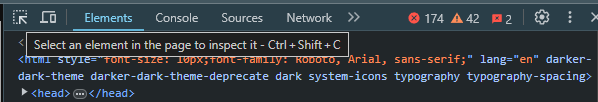

# Inspecting Webpages
## Inspect Element
HTML in its most basic forms can be easy to break up and look at. We can have body, head, html tags that help define what we are looking at. When webscraping, this can get more difficult. Websites don't usually only consist of the basic tags mentioned. 

This button - in the top left hand can be selected to hover over elements and find out more information about them. 

